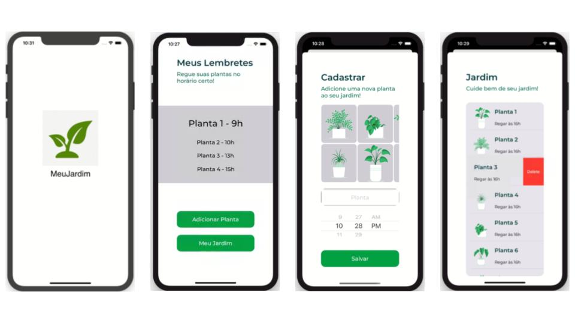
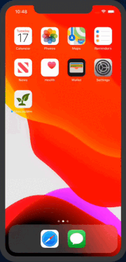

# MeuJardim

Aplicação desenvolvida para o desafio final do Curso Swift Explorations do Instituto Eldorado.

Aplicativo para iOS desenvolvido em linguagem Swift. Ele ajuda as pessoas a lembrarem de regar suas plantas.

## Funcionalidades previstas

- Cadastrar plantas
- Visualizar jardim
- Criar alarmes
- Excluir plantas

## Demonstração

### Screenshots

### GIF

## Aprendizados

- Componentes usuais de UI
- TableView
- CollectionView
- Swipe action
- Splash
- Ligação entre views

## Melhorias

- Comunicação com banco de dados interno/externo
- Geração de notificações

## Autor

<table>
    <tr><td align="center">
        <a href="https://github.com/danielsmorais">
            
             
            <b>Daniel Morais</b>
        </a>
    </td></tr>
</table>
